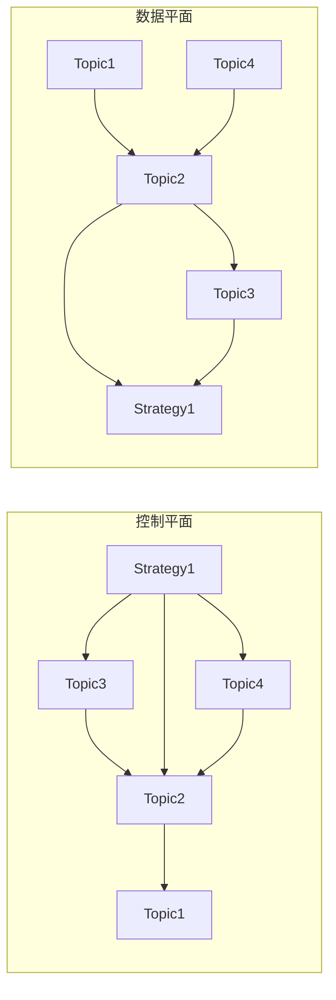

t # 图计算

```mermaid
flowchart LR

    subgraph 控制平面

        T2[Topic2] --> T1[Topic1]
        T3[Topic3] --> T2[Topic2]

        S1[Strategy1] --> T2[Topic2]
        S1[Strategy1] --> T3[Topic3]

        S1[Strategy1] --> T4[Topic4]

        T4[Topic4] --> T2[Topic2]

    end


    subgraph 数据平面

        Topic1 --> Topic2
        Topic2 --> Topic3
        Topic4 --> Topic2

        Topic2 --> Strategy1
        Topic3 --> Strategy1

    end


```
