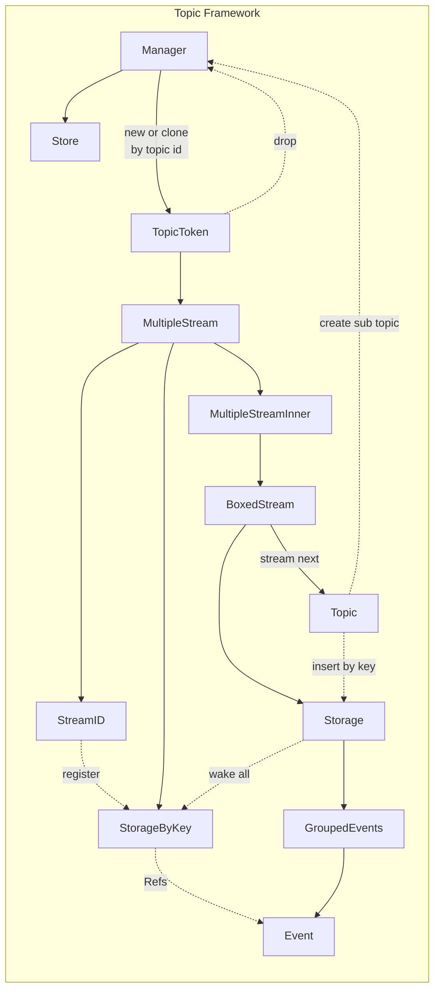

```mermaid
flowchart LR
    subgraph Topic Framework

        Manager --> Store
        Manager -->|new or clone\nby topic id| TopicToken
        TopicToken -..->|drop| Manager
        TopicToken --> MultipleStream
        MultipleStream --> StreamID
        MultipleStream --> StorageByKey
        MultipleStream --> MultipleStreamInner
        MultipleStreamInner --> BoxedStream
        BoxedStream --> Storage
        BoxedStream -->|stream next| Topic
        Storage -.->|wake all| StorageByKey
        Storage --> GroupedEvents --> Event
        StreamID -.->|register| StorageByKey
        StorageByKey -.->|Refs| Event
        Topic -.->|create sub topic| Manager
        Topic -.->|insert by key| Storage

    end
```
