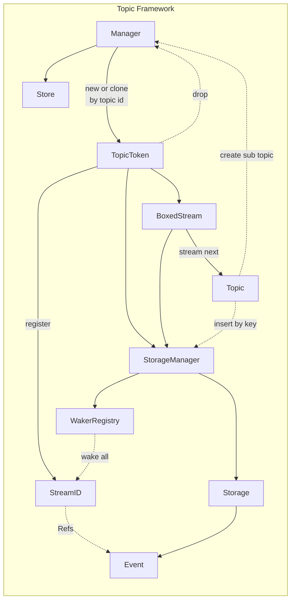

```mermaid
flowchart LR
    subgraph Topic Framework

        Manager --> Store
        Manager -->|new or clone\nby topic id| TopicToken
        TopicToken -..->|drop| Manager
        TopicToken --> BoxedStream
        TopicToken --> StorageManager
        TopicToken -->|register| StreamID
        StreamID -.->|Refs| Event
        BoxedStream --> StorageManager
        BoxedStream -->|stream next| Topic
        StorageManager --> Storage
        StorageManager --> WakerRegistry
        WakerRegistry -.->|wake all| StreamID
        Storage --> Event
        Topic -.->|create sub topic| Manager
        Topic -.->|insert by key| StorageManager

    end
```
