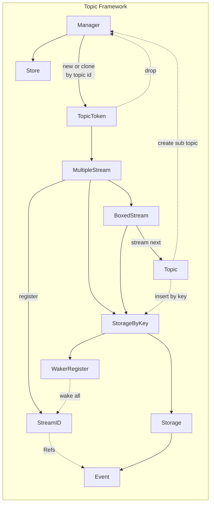

```mermaid
flowchart LR
    subgraph Topic Framework

        Manager --> Store
        Manager -->|new or clone\nby topic id| TopicToken
        TopicToken -..->|drop| Manager
        TopicToken --> MultipleStream
        MultipleStream --> BoxedStream
        MultipleStream --> StorageByKey
        MultipleStream -->|register| StreamID
        StreamID -.->|Refs| Event
        BoxedStream --> StorageByKey
        BoxedStream -->|stream next| Topic
        StorageByKey --> Storage
        StorageByKey --> WakerRegister
        WakerRegister -.->|wake all| StreamID
        Storage --> Event
        Topic -.->|create sub topic| Manager
        Topic -.->|insert by key| StorageByKey

    end
```
